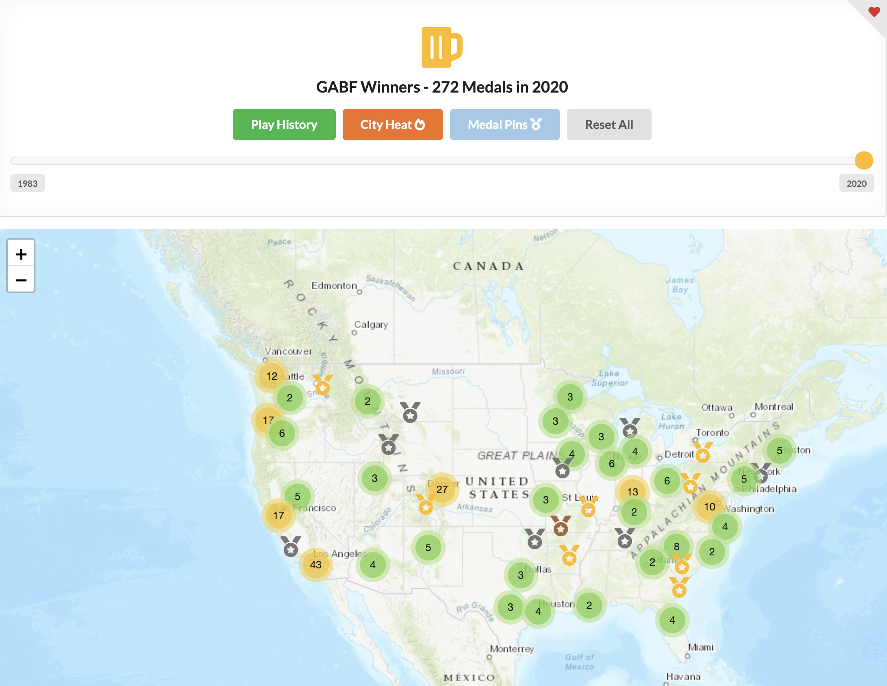
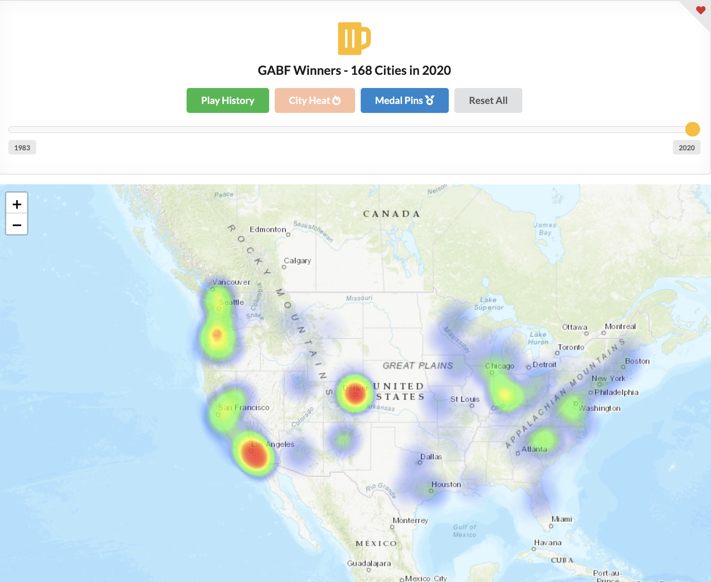

# Beer Fest JSON

This is a dataset of Great American Beer Fest (GABF) Winners and World Beer Cup (WBC) Winners.

Check it Out

https://www.andrewvantassel.com/beerfest-winners

## Data is from 

- https://www.greatamericanbeerfestival.com/the-competition/winners
- https://www.worldbeercup.org/winners/award-winners

## Setup
This would be best with the Google Places API, add your API key to `lib/Google.php`
Otherwise download and import US cities from https://simplemaps.com/data/us-cities

```sh
mongoimport -d beer-fest -c cities --type csv --file uscities.csv --headerline
```

## Using the Scripts

```sh
# Mongo import
php mongo-import.php

# After the winners are announced you can run
php gabf-update.php
php wbc-update.php
```

## Running the map

```sh
npm install http-server -g
http-server map/
# or 
php -S 127.0.0.1:8080
```


